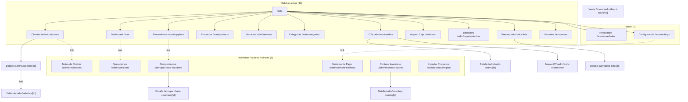
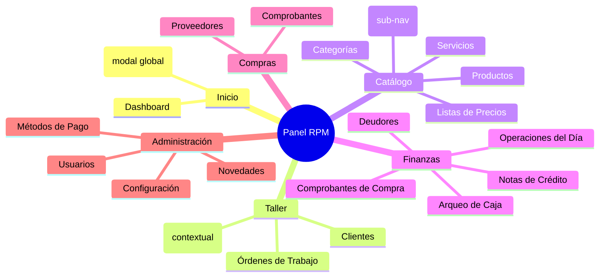
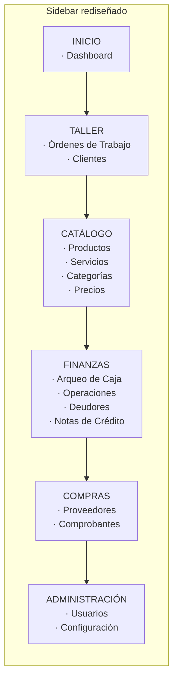
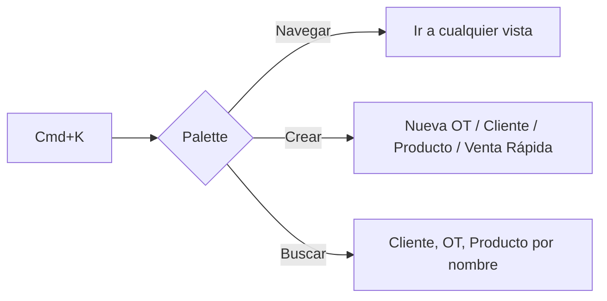
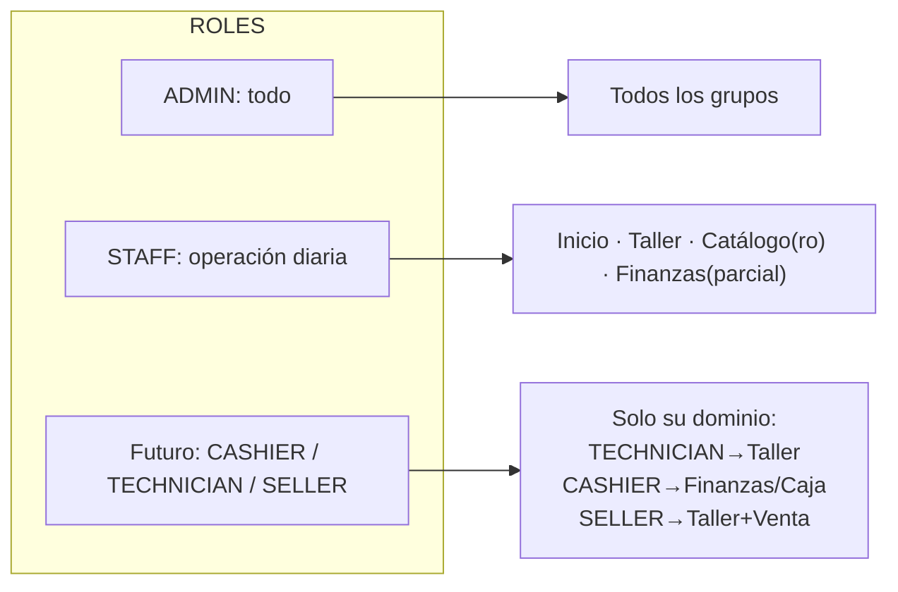

# Rediseño de Navegación del Panel Admin

Reorganizar las 28 rutas del `/adm` en un sidebar agrupado por dominio operativo + Command Palette (Cmd+K) + sub-navegación contextual, con visibilidad por rol incorporada desde el diseño, para reducir entropía y escalar orgánicamente.

---

## 1. Mapa de Navegación Actual (fuente de la verdad)

### Estado del sidebar hoy
- **Sidebar plano**: 11 items sin agrupar (`AppSidebar.tsx`).
- **Footer**: Novedades, Configuración, Avatar.
- **6 vistas huérfanas** sin acceso directo descubrible.

### Inventario completo de rutas

### Problemas detectados
- **P1 — Huérfanas**: `inventory-counts`, `operations`, `credit-notes`, `purchase-vouchers` no tienen entrada de menú; se descubren por azar.
- **P2 — Mezcla de jerarquías**: catálogo (Productos/Servicios/Categorías/Precios) y finanzas (Caja/Deudores) conviven en el mismo nivel que Clientes/OTs sin separación visual.
- **P3 — Sin agrupación**: 11 items planos → cuando crezca a 20+, el aside se vuelve inmanejable.
- **P4 — Sin búsqueda global**: para ir a una vista hay que escanear todo el menú.
- **P5 — Roles no contemplados**: hoy todo STAFF ve todo; no hay forma de ocultar Usuarios/Configuración/Finanzas a roles menores.

---

## 2. Rediseño Propuesto

### 2.1 Modelo mental: Sidebar por dominio + Command Palette + sub-nav contextual

### 2.2 Sidebar agrupado (colapsable por sección)

- Cada grupo es un **`SidebarGroup` colapsable** (shadcn ya lo soporta) con label e ícono.
- **Inventario** (`inventory-counts`, `products/import`) entra como **sub-nav contextual** dentro de Productos (tabs/acciones en el Header), no como item de primer nivel.
- **Vehículos** sigue siendo contextual (desde Cliente/OT), no va al menú.

### 2.3 Command Palette (Cmd+K / Ctrl+K)

- Componente nuevo `CommandPalette` (usa `cmdk` o `Command` de shadcn).
- Indexa rutas + acciones de creación + búsqueda de entidades.
- Resuelve P4 y permite crecer sin saturar el aside (P3).

### 2.4 Quick-Create global
- Botón **"+ Crear"** en el header del layout (o dentro del palette) con menú: Nueva OT, Nuevo Cliente, Venta Rápida, Nuevo Producto.
- Centraliza los flujos comunes que hoy están dispersos.

---

## 3. Navegación con Roles (a futuro)

### 3.1 Modelo de visibilidad declarativa
Cada item/grupo declara `roles: UserRole[]`. El sidebar y el palette filtran por el rol de sesión.

### 3.2 Mapeo propuesto (borrador, ajustable)

| Grupo / Item | ADMIN | STAFF | TECHNICIAN | CASHIER | SELLER |
|---|---|---|---|---|---|
| Dashboard | ✅ | ✅ | ✅ | ✅ | ✅ |
| Taller (OTs, Clientes) | ✅ | ✅ | ✅ | — | ✅ |
| Catálogo | ✅ | ✅ | lectura | — | lectura |
| Finanzas (Caja, Operaciones) | ✅ | ✅ | — | ✅ | — |
| Finanzas (Deudores, NC) | ✅ | ✅ | — | ✅ | parcial |
| Compras (Proveedores, Comprobantes) | ✅ | ✅ | — | — | — |
| Administración (Usuarios, Config) | ✅ | — | — | — | — |

### 3.3 Implementación técnica del filtrado
- Extender la estructura `navigation` en `AppSidebar.tsx` a `NavGroup[]` con `{ label, icon, roles, items: NavItem[] }`.
- Helper `canAccess(role, item.roles)` para filtrar grupos/items.
- Mismo helper alimenta el `CommandPalette` (no muestra lo que el rol no puede ver).
- Reutiliza el `UserRole` enum existente (`lib/auth/roles.ts`) — ya tiene ADMIN/STAFF/USER; los roles granulares futuros se mapean ahí.

---

## 4. Cambios de Vista ↔ Modal sugeridos

| Vista actual | Propuesta | Razón |
|---|---|---|
| `inventory-counts` (página suelta) | Sub-nav dentro de Productos | Es una operación de catálogo, no un dominio top-level |
| `products/import` (página suelta) | Acción/modal desde Productos | Flujo puntual, no merece item de menú |
| `payment-methods` | Mantener dentro de Configuración | Correcto, ya es contextual |
| `operations` | Promover a Finanzas (item visible) | Hoy huérfana, es uso diario de caja |
| `credit-notes` | Promover a Finanzas (item visible) | Hoy solo accesible por link |
| Venta Rápida (modal) | Mantener modal + acceso desde Quick-Create | Flujo rápido, no necesita página |

---

## 5. Entregables del Plan

1. **`NAVIGATION.md`** (nuevo, raíz): mapa fuente-de-verdad con los diagramas de §1 y §2 + tabla de roles (§3.2). Documento vivo.
2. **Refactor `AppSidebar.tsx`**: estructura `NavGroup[]` con grupos colapsables + `roles` por item.
3. **Nuevo `CommandPalette.tsx`** + hook `useCommandPalette` (Cmd+K).
4. **Nuevo `QuickCreateMenu`** en el header del layout.
5. **Helper `lib/nav/canAccess.ts`** + definición central `lib/nav/navConfig.ts` (única fuente para sidebar + palette).
6. **Sub-nav contextual** en Productos para Importar/Conteos.

> Orden sugerido de implementación: (1) doc + navConfig → (2) refactor sidebar agrupado → (3) command palette → (4) quick-create → (5) sub-nav productos. Cada paso ≤5 archivos, validable por separado.

---

## 6. Fuera de alcance (este plan)
- Implementar los roles granulares en backend (solo se deja la navegación preparada).
- Cambios de lógica de negocio en las vistas.
- Rediseño visual de las vistas internas (ya cubierto en QA previo / `DESIGN.md`).
